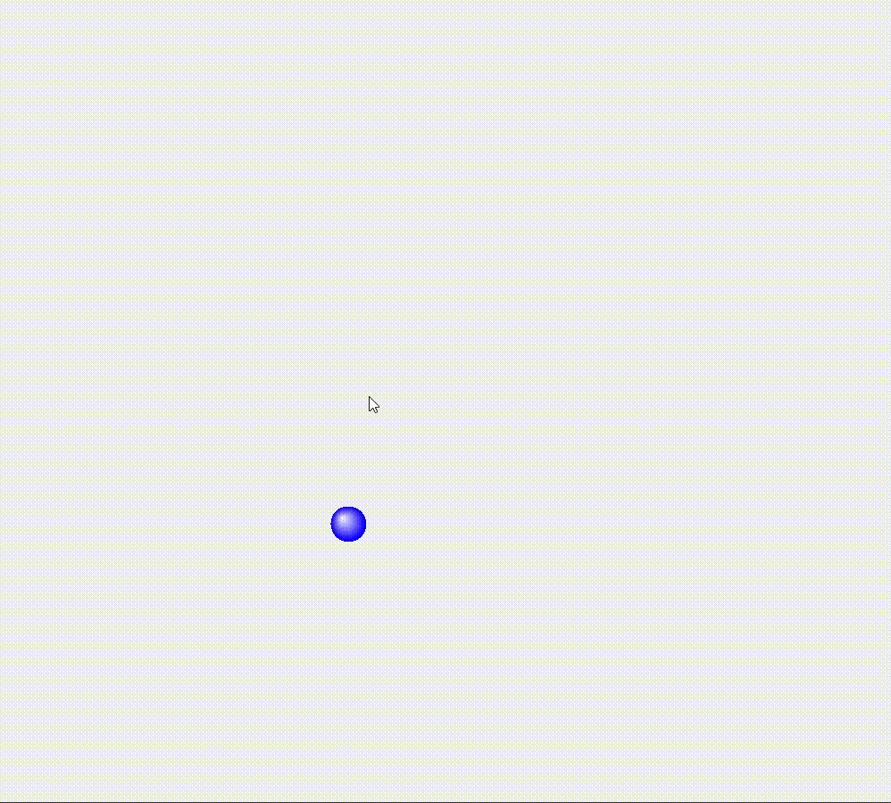

# Numerical Methods in Game Programming

This project includes two samples on numerical method implementation in game programming. 
1. Bouncing Ball
2. Bowman

## Getting Started

Here is a guideline to help you get started to run this program.
1. Clone this repository
2. Run the main method in `src/BouncingBall.java` or `src/Bowman.java`

** *No project management such as Maven and Gradle is used in this project since no library is used in this program*

## Folder Structure

The workspace contains two folders by default, where:

- `src`: the folder to maintain sources
- `lib`: the folder to maintain dependencies

Meanwhile, the compiled output files will be generated in the `bin` folder by default if VS Code is used.

## Game Scenes
### Bouncing Ball
A simple game with ball bouncing on wall. Player can hold and throw the ball using mouse.

Numerical method is implemented in computing the ball deformation and gravity force.

### Bowman
A simple 2 players game. Players can control each bownman to shoot by dragging using mouse.

Numerical method is implemented in computing the angle, force applied to arrow, projectile motion and gravity.

